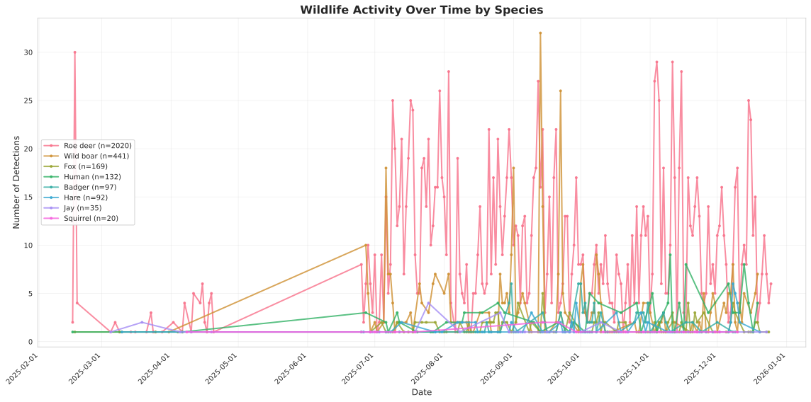
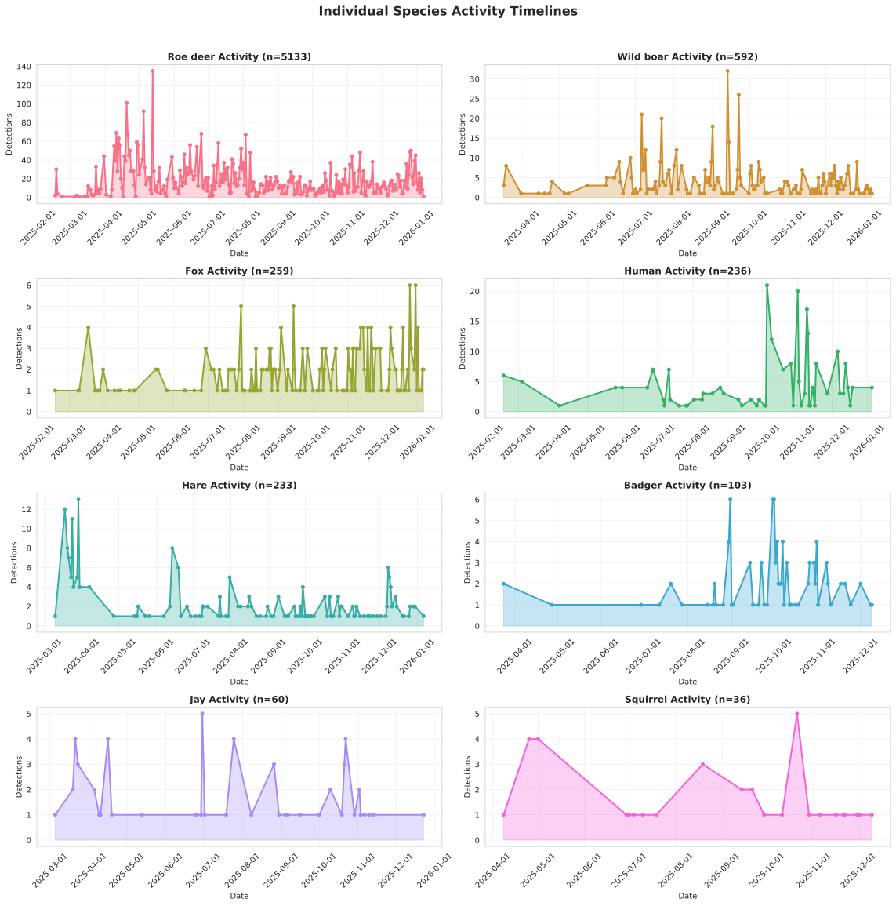

# Visualisations

Wildlife activity patterns and analysis visualisations.

## Table of Contents

- [Visualisations](#visualisations)
  - [Table of Contents](#table-of-contents)
  - [Species Distribution](#species-distribution)
    - [Species Distribution](#species-distribution-1)
  - [Activity Patterns](#activity-patterns)
    - [Species Activity Patterns](#species-activity-patterns-1)
  - [Environmental Factors](#environmental-factors)
    - [Lighting Analysis](#lighting-analysis)
    - [Location Comparison](#location-comparison)
    - [Baiting Effect Analysis](#baiting-effect-analysis)
    - [Roe Deer - Temperature Activity](#roe-deer---temperature-activity)
    - [Wild Boar - Temperature Activity](#wild-boar---temperature-activity)
  - [Activity Timeline](#activity-timeline)
    - [Species Activity Timeline](#species-activity-timeline)
    - [Individual Species Timelines](#individual-species-timelines)
  - [Crepuscular Activity Analysis](#crepuscular-activity-analysis)
    - [Roe Deer - Sunset Activity Scatter](#roe-deer---sunset-activity-scatter)
    - [Wild Boar - Sunset Activity Scatter](#wild-boar---sunset-activity-scatter)
    - [Roe Deer - Sunrise Activity Scatter](#roe-deer---sunrise-activity-scatter)
    - [Wild Boar - Sunrise Activity Scatter](#wild-boar---sunrise-activity-scatter)
    - [Roe Deer - Monthly Sunset Patterns](#roe-deer---monthly-sunset-patterns)
    - [Wild Boar - Monthly Sunset Patterns](#wild-boar---monthly-sunset-patterns)
    - [Roe Deer - Daily and Yearly Activity Pattern](#roe-deer---daily-and-yearly-activity-pattern)
    - [Wild Boar - Daily and Yearly Activity Pattern](#wild-boar---daily-and-yearly-activity-pattern)
  - [Solunar Period Analysis](#solunar-period-analysis)
    - [Solunar Comparison](#solunar-comparison)
  - [Summary Statistics](#summary-statistics)

## Species Distribution

### Species Distribution


Overall distribution of species detections across the study area, shown in both bar chart and pie chart formats.

## Activity Patterns

### Species Activity Patterns


Activity patterns broken down by individual species, showing hourly activity for top 8 species.

## Environmental Factors

### Lighting Analysis


Analysis of wildlife activity under different lighting conditions (bright vs dark), including species-specific day/night preferences.

### Location Comparison


Comparison of wildlife activity across different camera locations, showing species diversity at each site.

### Baiting Effect Analysis


Impact of baiting (human activity) on wildlife presence, showing timeline comparison and before/after analysis.

### Roe Deer - Temperature Activity


Detailed temperature-activity relationship analysis for roe deer, including temperature vs time scatter, distribution patterns, hourly activity by temperature, monthly variations, and statistical summary.

### Wild Boar - Temperature Activity


Detailed temperature-activity relationship analysis for wild boar, including temperature vs time scatter, distribution patterns, hourly activity by temperature, monthly variations, and statistical summary.

## Activity Timeline

### Species Activity Timeline



Temporal distribution of all species detections across the study period, showing activity peaks and patterns over time.

### Individual Species Timelines



Separate timeline views for roe deer and wild boar, showing their individual temporal activity patterns.

## Crepuscular Activity Analysis

### Roe Deer - Sunset Activity Scatter


Scatter plot showing roe deer activity relative to sunset times throughout the year, with distribution histogram.

### Wild Boar - Sunset Activity Scatter


Scatter plot showing wild boar activity relative to sunset times throughout the year, with distribution histogram.

### Roe Deer - Sunrise Activity Scatter


Scatter plot showing roe deer activity relative to sunrise times throughout the year, with distribution histogram.

### Wild Boar - Sunrise Activity Scatter


Scatter plot showing wild boar activity relative to sunrise times throughout the year, with distribution histogram.

### Roe Deer - Monthly Sunset Patterns


Monthly variation in roe deer activity patterns relative to sunset, showing seasonal trends.

### Wild Boar - Monthly Sunset Patterns


Monthly variation in wild boar activity patterns relative to sunset, showing seasonal trends.

### Roe Deer - Daily and Yearly Activity Pattern


Comprehensive heatmap showing roe deer activity across hour of day and month of year (last 12 months).

### Wild Boar - Daily and Yearly Activity Pattern


Comprehensive heatmap showing wild boar activity across hour of day and month of year (last 12 months).

## Solunar Period Analysis

### Solunar Comparison


Direct comparison of roe deer and wild boar activity patterns relative to moon illumination and moon phases, showing potential differences in lunar sensitivity between species.

---

## Summary Statistics

```text

```

---

[Back to Home](index.md)
