# Visualisations

Wildlife activity patterns and analysis visualisations.

## Species Distribution

### Species Distribution

Overall distribution of species detections across the study area.

## Activity Patterns

### Activity by Hour

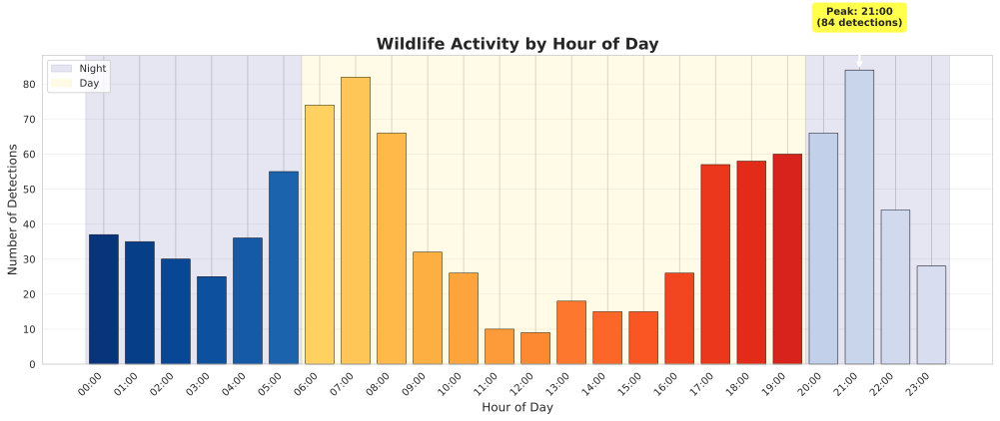

Hourly activity patterns showing when wildlife is most active throughout the day.

### Species Activity Patterns

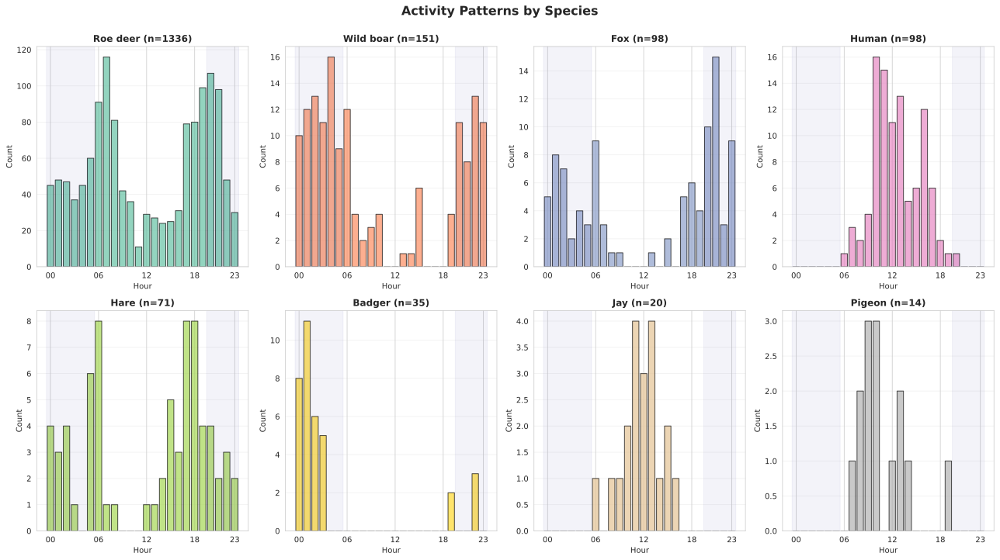

Activity patterns broken down by individual species.

## Environmental Factors

### Lighting Analysis

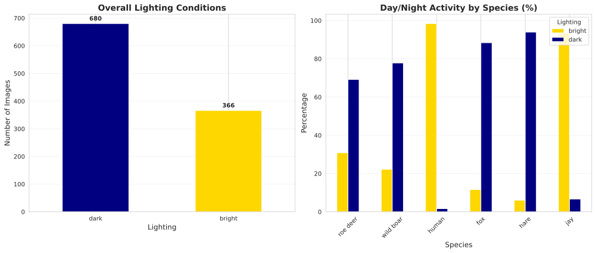

Analysis of wildlife activity under different lighting conditions.

### Temperature Analysis

Correlation between temperature and wildlife activity.

### Temperature-Activity Relationships

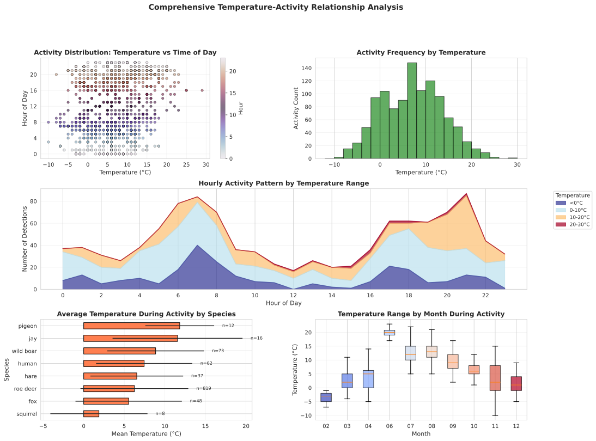

Comprehensive analysis of temperature-activity relationships including scatter plots, hourly patterns, species preferences, and monthly variations.

### Roe Deer - Temperature Activity Analysis

Detailed temperature-activity relationship analysis for roe deer, including distribution patterns, hourly activity by temperature, and statistical correlations.

### Wild Boar - Temperature Activity Analysis

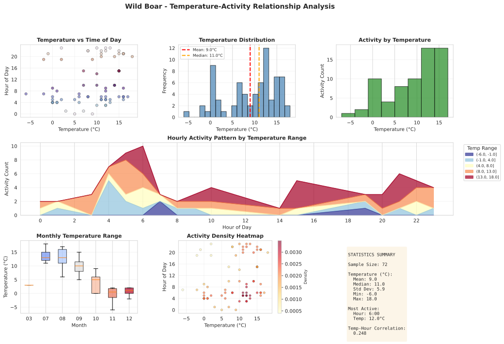

Detailed temperature-activity relationship analysis for wild boar, including distribution patterns, hourly activity by temperature, and statistical correlations.

## Location and Baiting Effects

### Location Comparison

Comparison of wildlife activity across different locations.

### Baiting Effect Analysis

Impact of baiting on wildlife presence and behavior.

## Activity Timelines

### Overall Activity Timeline

Timeline showing wildlife activity over the study period.

### Species Activity Timeline

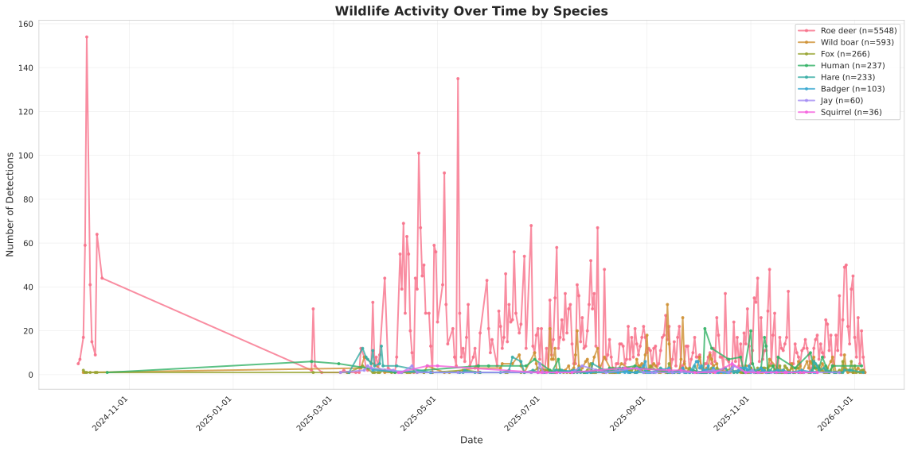

Timeline of activity patterns for different species.

### Species Activity Timeline (Alternative)

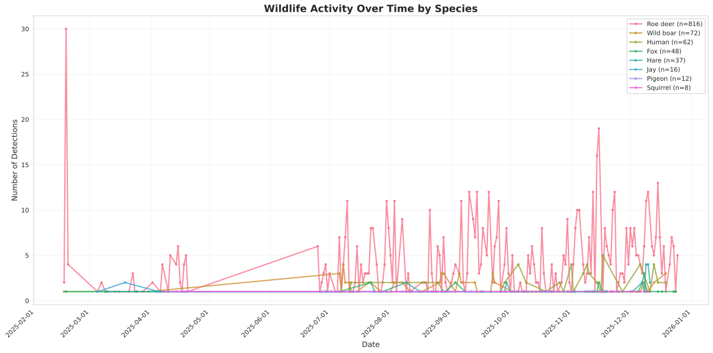

Alternative view of species activity timeline with different visualization approach.

### Individual Species Timelines

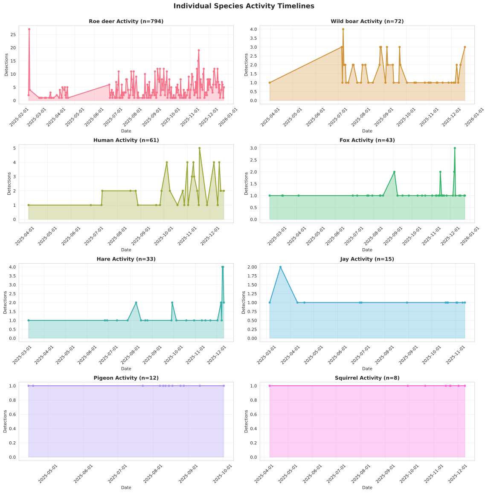

Detailed timelines for individual species.

## Sunset/Sunrise Activity Analysis

### Roe Deer - Sunset Activity Scatter

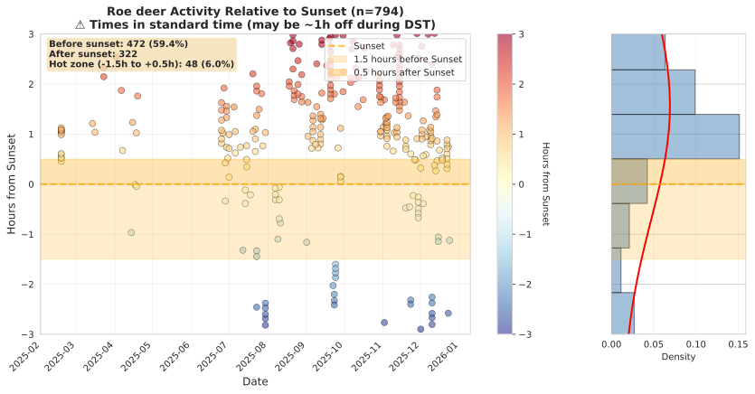

Scatter plot showing roe deer activity relative to sunset times.

### Wild Boar - Sunset Activity Scatter

Scatter plot showing wild boar activity relative to sunset times.

### Roe Deer - Sunrise Activity Scatter

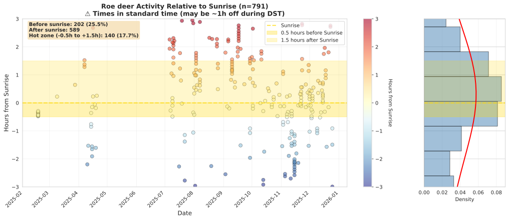

Scatter plot showing roe deer activity relative to sunrise times.

### Wild Boar - Sunrise Activity Scatter

Scatter plot showing wild boar activity relative to sunrise times.

### Roe Deer - Sunset Activity Distribution

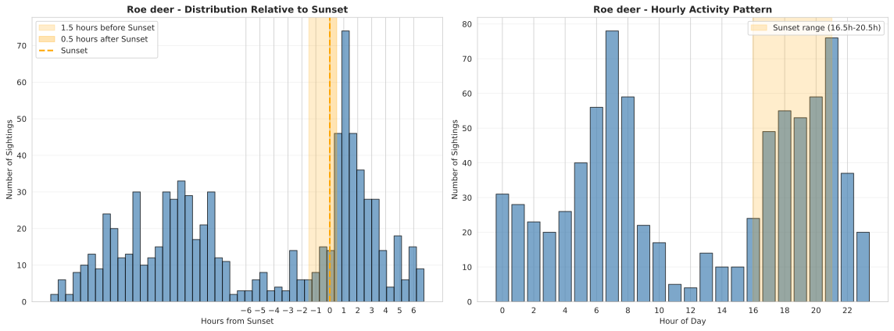

Distribution of roe deer activity around sunset.

### Wild Boar - Sunset Activity Distribution

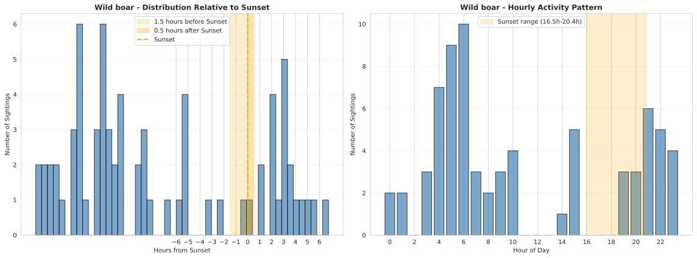

Distribution of wild boar activity around sunset.

## Monthly Sunset Patterns

### Roe Deer - Monthly Sunset Patterns

Monthly variation in roe deer activity patterns relative to sunset.

### Wild Boar - Monthly Sunset Patterns

Monthly variation in wild boar activity patterns relative to sunset.

## Daily and Yearly Activity Patterns

### Roe Deer - Daily and Yearly Activity Pattern

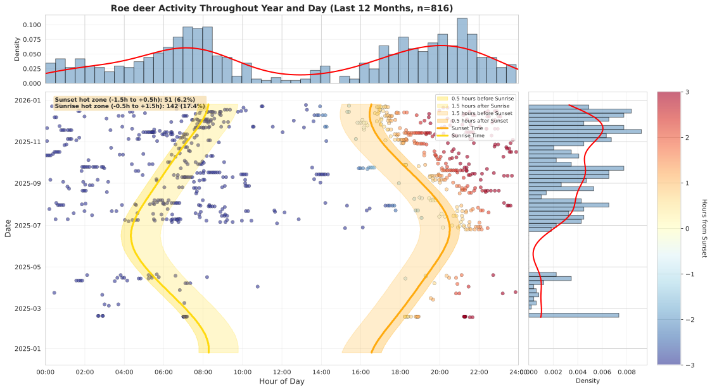

Combined daily and yearly activity pattern for roe deer.

### Wild Boar - Daily and Yearly Activity Pattern

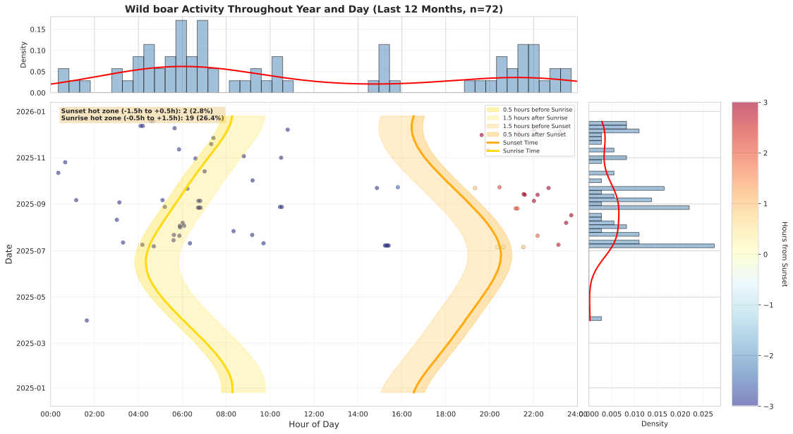

Combined daily and yearly activity pattern for wild boar.

### Combined Daily and Yearly Activity Pattern

Combined daily and yearly activity patterns across all species.

---

[Back to Home](index.md)
