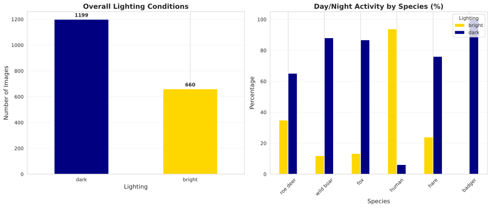
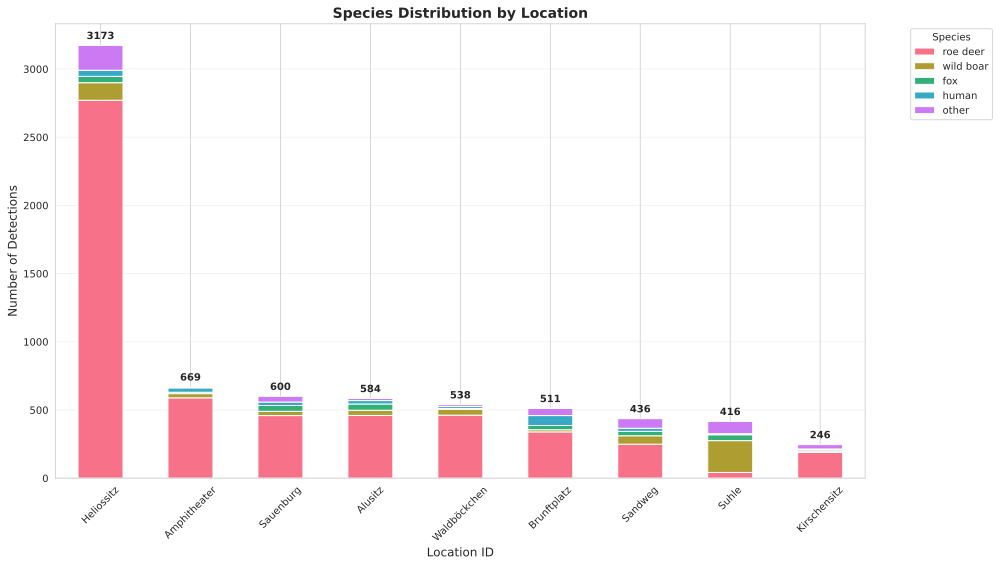
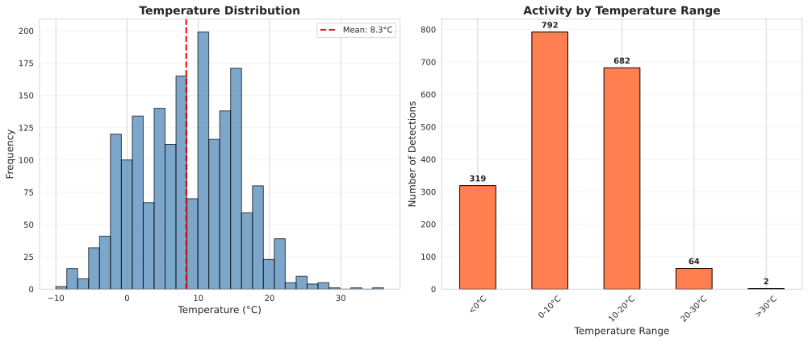
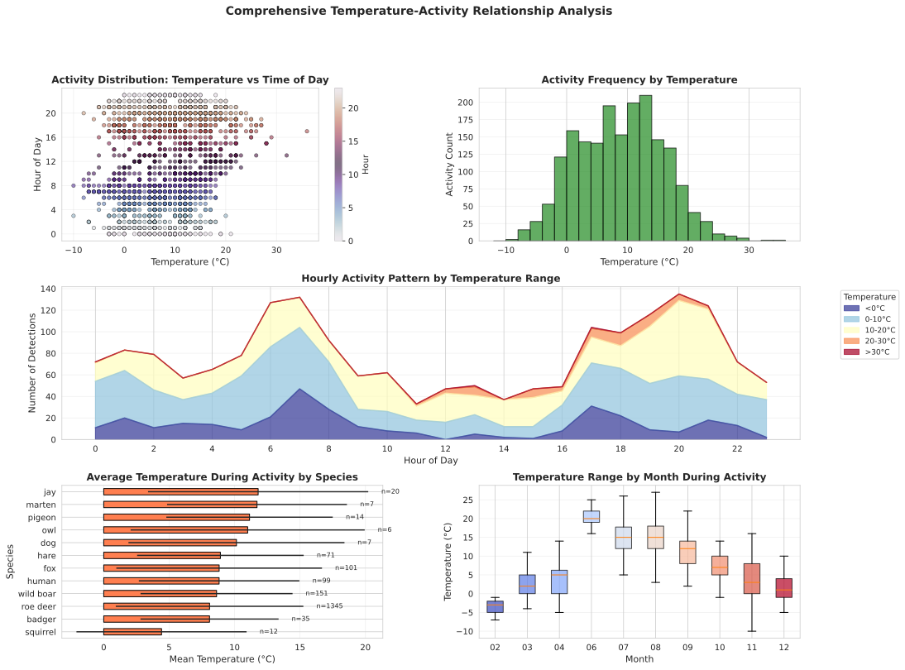
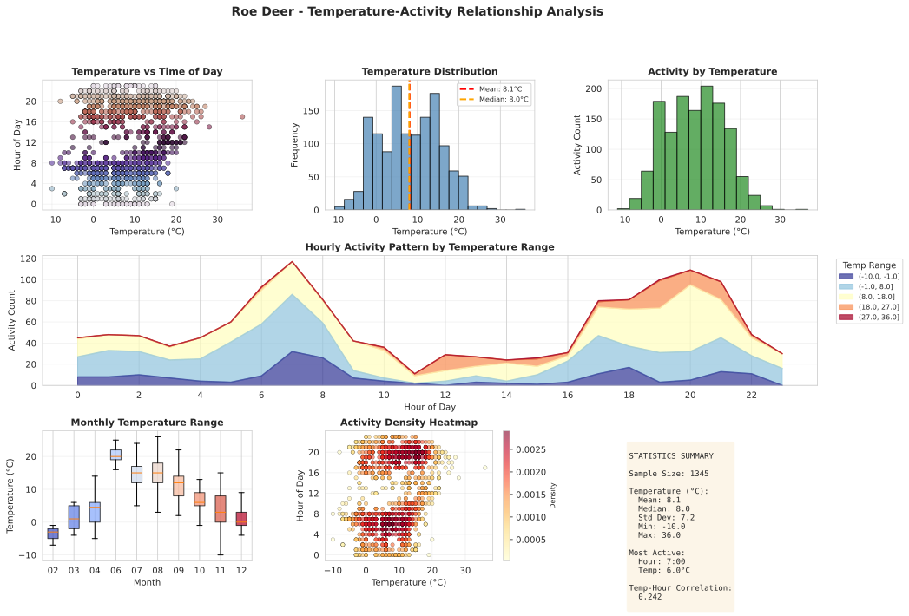
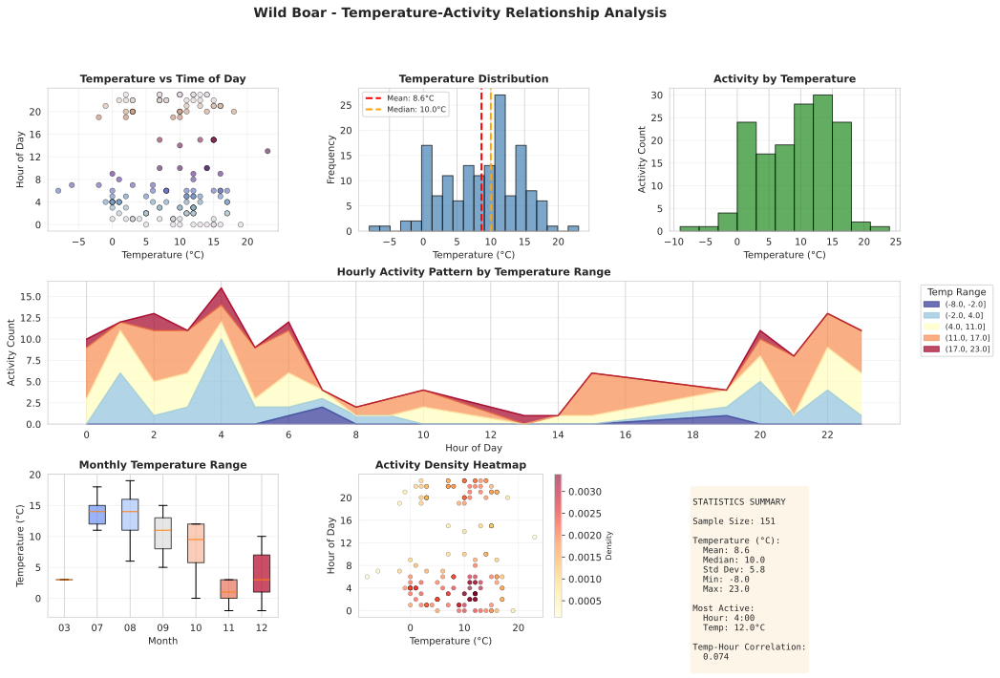
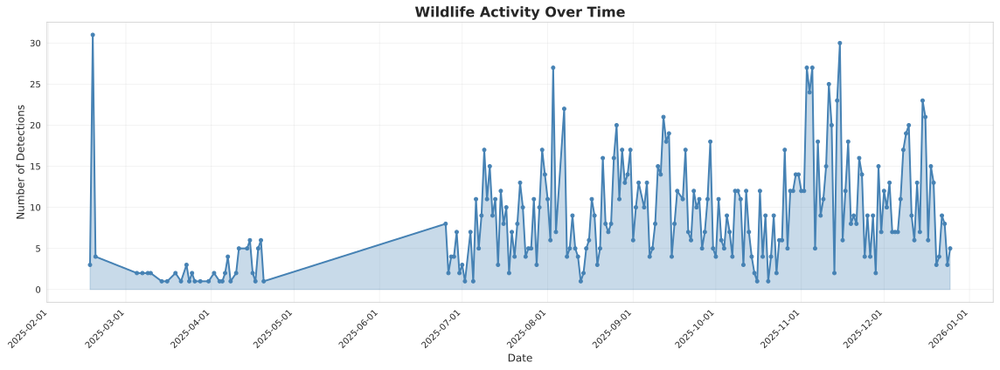
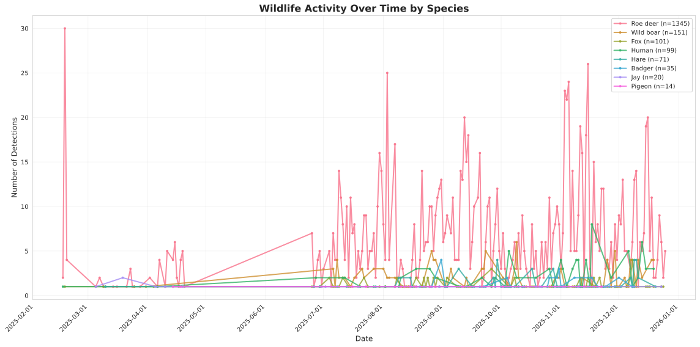
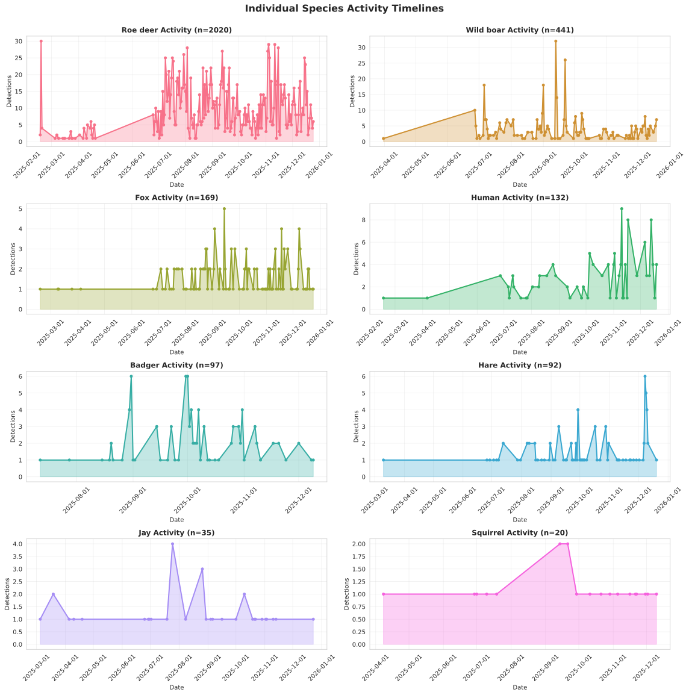
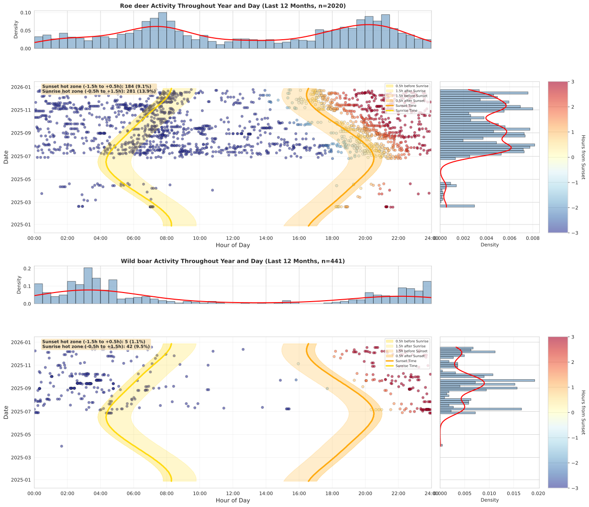

# Visualisations

Wildlife activity patterns and analysis visualisations.

## Species Distribution

### 01. Species Distribution


Overall distribution of species detections across the study area, shown in both bar chart and pie chart formats.

## Activity Patterns

### 02. Activity by Hour


Hourly activity patterns showing when wildlife is most active throughout the day, with day/night indicators.

### 03. Species Activity Patterns


Activity patterns broken down by individual species, showing hourly activity for top 8 species.

## Environmental Factors

### 04. Lighting Analysis



Analysis of wildlife activity under different lighting conditions (bright vs dark), including species-specific day/night preferences.

### 05. Location Comparison



Comparison of wildlife activity across different camera locations, showing species diversity at each site.

### 06. Baiting Effect Analysis


Impact of baiting (human activity) on wildlife presence, showing timeline comparison and before/after analysis.

### 07. Temperature Analysis



Basic temperature analysis showing distribution of detections across temperature ranges.

### 08. Temperature-Activity Relationships



Comprehensive analysis of temperature-activity relationships including scatter plots, hourly patterns by temperature range, species temperature preferences, and monthly temperature distributions.

### 09. Roe Deer - Temperature Activity



Detailed temperature-activity relationship analysis for roe deer, including temperature vs time scatter, distribution patterns, hourly activity by temperature, monthly variations, and statistical summary.

### 10. Wild Boar - Temperature Activity



Detailed temperature-activity relationship analysis for wild boar, including temperature vs time scatter, distribution patterns, hourly activity by temperature, monthly variations, and statistical summary.

## Activity Timelines

### 11. Overall Activity Timeline



Timeline showing total wildlife activity over the study period with daily counts.

### 12. Species Activity Timeline



Combined timeline showing activity patterns for multiple species over time.

### 13. Individual Species Timelines



Separate timeline panels for each of the top species, showing individual activity patterns.

## Crepuscular Activity Analysis

### 14. Roe Deer - Sunset Activity Scatter


Scatter plot showing roe deer activity relative to sunset times throughout the year, with distribution histogram.

### 15. Wild Boar - Sunset Activity Scatter


Scatter plot showing wild boar activity relative to sunset times throughout the year, with distribution histogram.

### 16. Roe Deer - Sunrise Activity Scatter


Scatter plot showing roe deer activity relative to sunrise times throughout the year, with distribution histogram.

### 17. Wild Boar - Sunrise Activity Scatter


Scatter plot showing wild boar activity relative to sunrise times throughout the year, with distribution histogram.

### 18. Roe Deer - Sunset Activity Distribution


Detailed distribution analysis of roe deer activity around sunset, showing activity peaks and patterns.

### 19. Wild Boar - Sunset Activity Distribution


Detailed distribution analysis of wild boar activity around sunset, showing activity peaks and patterns.

### 20. Roe Deer - Monthly Sunset Patterns


Monthly variation in roe deer activity patterns relative to sunset, showing seasonal trends.

### 21. Wild Boar - Monthly Sunset Patterns


Monthly variation in wild boar activity patterns relative to sunset, showing seasonal trends.

### 22. Roe Deer - Daily and Yearly Activity Pattern


Comprehensive heatmap showing roe deer activity across hour of day and month of year (last 12 months).

### 23. Wild Boar - Daily and Yearly Activity Pattern


Comprehensive heatmap showing wild boar activity across hour of day and month of year (last 12 months).

### 24. Combined Daily and Yearly Activity Pattern



Side-by-side comparison of daily and yearly activity patterns for both roe deer and wild boar.

---

## Summary Statistics

```

```

---

[Back to Home](index.md)
